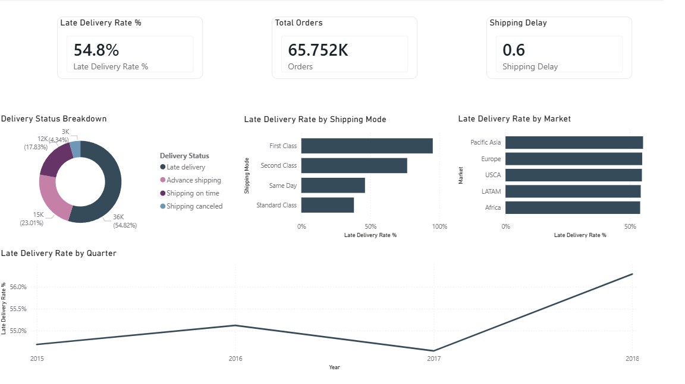
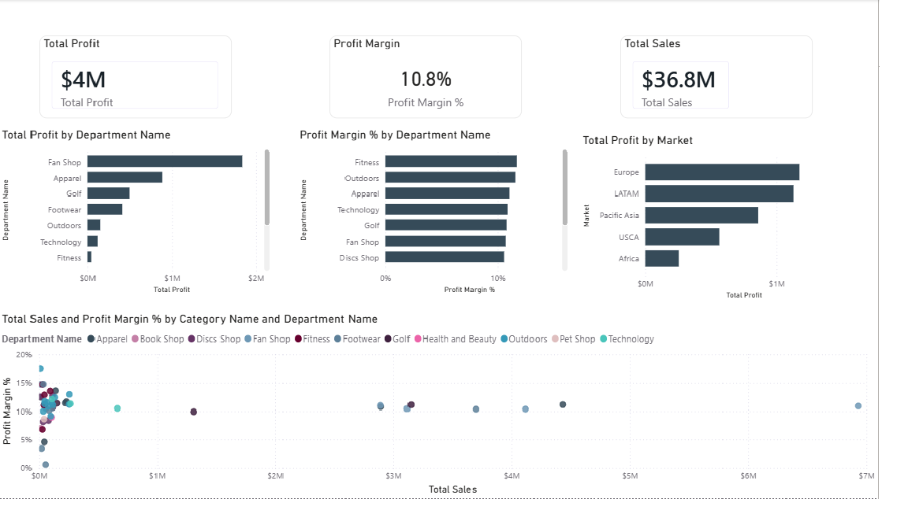
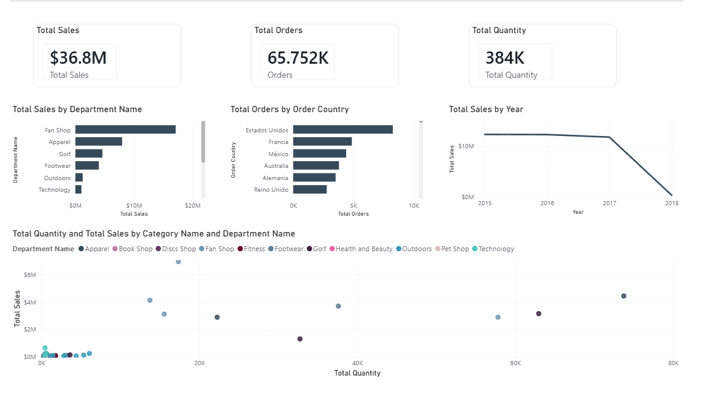
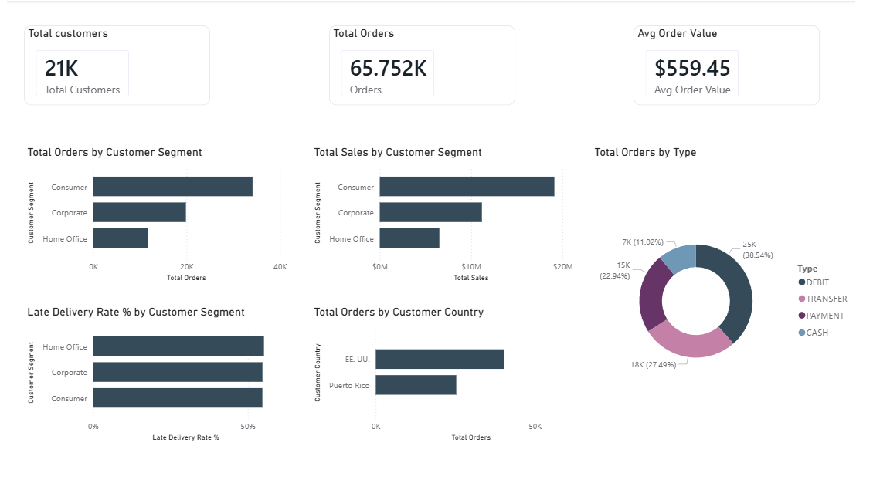

# DataCo Supply Chain Analysis
**Tool:** Power BI | **Dataset:** DataCo Smart Supply Chain (Kaggle) | **Status:**  In Progress

## Business Problem
DataCo Global needed to understand why a significant portion of their orders were arriving late, which markets and shipping modes were most affected, and where profitability was being lost across their global supply chain operation.

## Key Findings

**Logistics Performance:**
- 54.8% of all orders arrive late, which is the central finding of this analysis
- First Class shipping has the highest late delivery rate, counterintuitive for a premium tier
- The problem is consistent across all global markets (~50%), suggesting systemic delivery time misestimation rather than a regional logistics failure
- Q4 shows the highest late delivery rate, coinciding with peak sales season

**Profitability:**
- Fan Shop leads in total profit (~$2M) but Fitness and Outdoors have superior profit margins per unit sold
- Fan Shop is the most capital-efficient department: higher margin despite lower sales volume than Fitness
- Europe and LATAM are the most profitable markets globally
- Africa shows the lowest profit contribution, attributed to infrastructure and customs barriers

**Sales and Products:**
- Fan Shop leads total sales at ~$20M, nearly double Apparel despite Apparel 
  moving more units — Fan Shop sells at higher price points
- The US leads total orders by a significant margin, followed by France and Mexico
- Sales grew consistently from 2015 to 2017, with 2018 showing a sharp drop 
  likely reflecting incomplete data for that year
- Fitness moves the highest unit volume (~80K) but at lower price points, 
  confirming its role as a high-volume, low-margin department

**Customer Analysis:**
- Consumer segment leads in both orders and sales, with Corporate and 
  Home Office following proportionally
- Late Delivery Rate is virtually identical across all segments (~54-55%), 
  confirming the delivery problem is systemic rather than segment-specific
- The US leads in customer orders, followed by Puerto Rico which is treated 
  as a separate country in the dataset
- Debit is the dominant payment method at 38.54%, followed by bank transfer 
  at 27.49%
  

## Dashboard Pages
| Page | Business Question | Status |
|------|------------------|--------|
| Logistics Performance | Where and why are deliveries failing? | ✅ Complete |
| Profitability | Which products and markets are actually profitable? | ✅ Complete |
| Sales and Products | What sells most and where? | ✅ Complete |
| Customer Analysis | Who buys and how do they behave? | ✅ Complete |

## Status
✅ Dashboard complete — design and GitHub documentation pending

## Data Model
Star schema with 1 fact table and 4 dimension tables built in Power BI:
- **Fact_Orders** — 180,519 transactions
- **Dim_Product** — 118 unique products (Department → Category → Product hierarchy)
- **Dim_Geography** — Global markets with combined key (Market → Region → Country → State → City hierarchy)
- **Dim_Date** — 2015–2018 custom date table with time intelligence
- **Dim_Customer** — Customer segments and locations

## DAX Measures
13 custom measures organized across 4 business areas: Sales and Products, Profitability, Logistics Performance, and Customer Analysis.

## Tools
Power BI Desktop | DAX | Power Query | Git | GitHub
